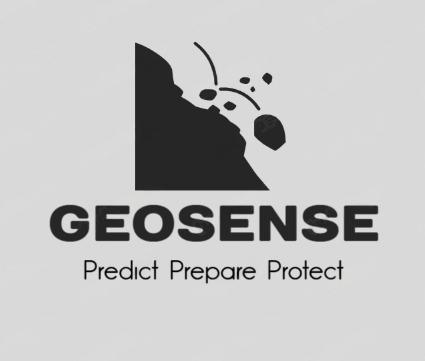
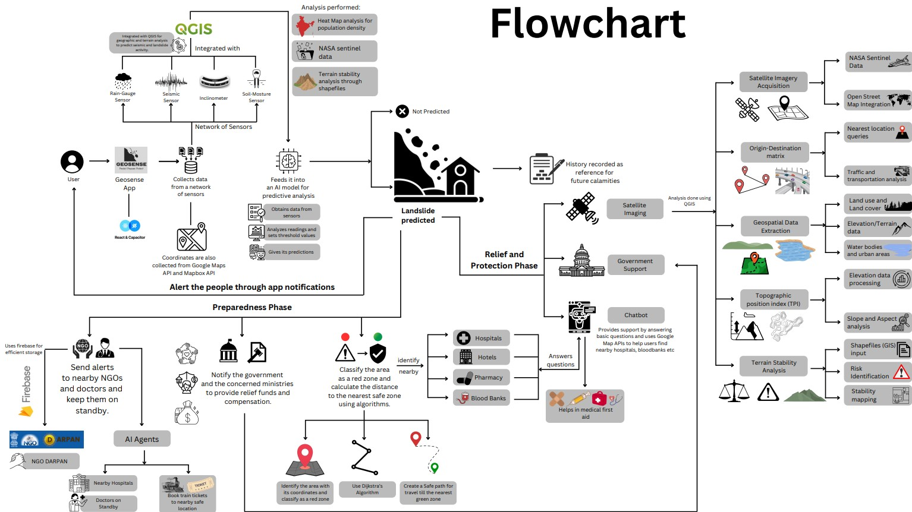
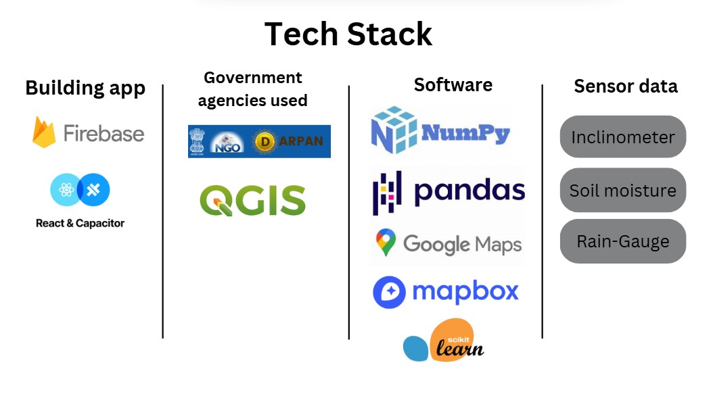
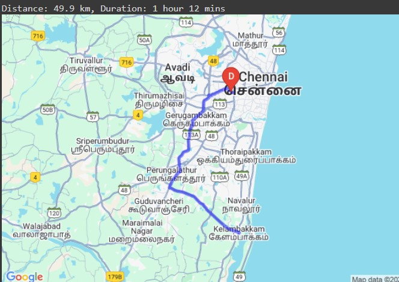

# GeoSense
GeoSense is a disaster prediction and monitoring system, focused on detecting landslides by analyzing various environmental factors. It utilizes real-time data such as rainfall, topography, slope, and seismic activity to provide accurate early warnings and insights into landslide-prone regions. It also helps in relief measures using satellite imaging, a chatbot for answering queries and government support.

 

# The Prediction Phase
# Features
* Real-time Data Collection: Gathers live data such as rainfall, topography, and slope to detect potential landslide risks.
  
* Environmental Analysis: Uses a combination of geographical factors and seismic data to create a comprehensive risk assessment.
  
* Self-Built Dataset: Uses detailed output tables with information like location, timestamp, latitude, longitude, depth, tilt, magnitude, temperature, humidity etc for prediction.
  
* Scalability: Can be adapted to various regions prone to natural disasters.
  
* Medical CHATBOT: Answers queries related to first aid and uses QGIS to give nearest hospital, blood bank locations.

* Predictive analysis ML model: 

# Process Flowchart
The below below clearly depicts the process flow involved in Geosense.

# Tech Stack Used
The tech stack used to build the app is as follows:

The Application:

* Google Firebase - To store and manage NGO data, ensuring efficient access and scalability.
* React and Capacitor - provides a powerful and flexible environment forbuilding and testing cross-platform apps.

Governement Organizations involved:

* QGIS - used to create, edit, visualize, analyze, and publish geospatial information.
* NGO DARPAN - a government platform listing over 100,000 active NGOs across India.

Software:
* Numpy - NumPy is a powerful Python library used for numerical computing.
* Pandas - A powerful Python library for data manipulation and analysis, providing data structures like DataFrames for easy handling of structured data.
* Requests - A simple and elegant HTTP library for Python, designed to make sending HTTP requests easy and user-friendly, allowing seamless integration with web APIs.
* Mapbox and Google Maps API  - A suite of APIs that enables developers to integrate Google Maps services into their applications, offering features like geolocation,directions, and places information for enhanced location-based experiences.

# Dataset used (SELF-BUILT)
This dataset contains the information of more than 560+ locations with latitude ad longitude specified. It also contains specific features of the land like tilt angle, magnitude, temperature, humidity, soil moisture, which effectively serves as a good dataset for landslide prediction analysis.

[Download the Dataset](dataset/Geosense_Dataset.xlsx)

# The Preparation phase
When a disaster is predicted, the app does the following:
1. Alerts nearby NGOs using data from NGO DARPAN.
2. Uses AI agents doctors and keeps them on standby. The agents also books train tickets to a nearby safe location.
3. Notifies the government and concerned ministries to provide relief fund and compensation and ask for evacuation help.
4. Classifies the zone as a 'RED ZONE' and uses basic algorithms to find the shortest and safest distance to a 'GREEN ZONE' (Safe zone).

# Algorithms used
1. Dijkstra's Algorithm : Calculates the shortest distance between the red zone and green zone.
2. A-Star Algorithm : A popular pathfinding and graph traversal algorithm that efficiently finds the shortest path from a start node to a target node by using heuristics.

# Google Maps API
After creating an API key, Google Maps APi was accessible. Using it we kept a source and a destination node to calculate the time to reach.

   

We were also able to achieve directions

 
